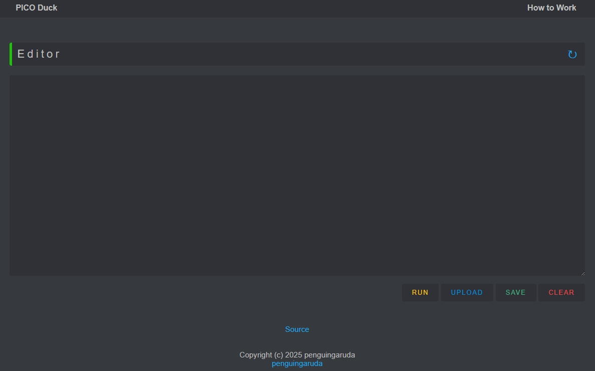

# WiPIDuck
Raspberry Pi Pico W | Wireless keystroke injection attack

## Credits
- Thank for CSS Style and Template [Spacehuhn](https://github.com/SpacehuhnTech).
- Implementation of using wifi duck on Raspberry Pi Pico W [dbisu](https://github.com/dbisu).
- `code.py` and `index.html`, thanks for [PicoWQuack](https://github.com/wirebits/PicoWQuack/)

## Features
- Responsive Web Interface
- Simple and clean webpage for type mnemonics.
- Run Button - Run typed mnemonics.
- Upload Button - Upload .txt files which contain mnemonics to run.
- Save Button - Save typed mnemonics on the system.
- Clear Button - Clears the text area.

## Getting Started
### Requirement
- Raspberry Pi Pico W
- Micro-USB Cable
### Installation
> #### 1. Install CircuitPython:
> - Download latest version [here](https://circuitpython.org/board/raspberry_pi_pico_w/)
> - Press `BOOTSEL` button and connect to the PC / Laptop.
> - Copy `.uf2` file to RPI PICO.
> - Download latest Adafruit CircuitPython Bundle [here](https://github.com/adafruit/Adafruit_CircuitPython_Bundle/releases)
> - Extract the ZIP file.
> - go to the `lib` folder, copy `adafruit_hid` and `adafruit_httpserver`
> - Paste copy to RPI PICO `lib` folder.
> #### 2. Install WiPIDuck Files on the Pico :
> - copy file `index.html` `code.py` `boot.py` and folder `web` to RPI PICO.
> - Done!, now you can connect to the `SSID : PicoTes` and `password : wifiduck123`
> - if you add `boot.py`, then pico will not be detected as a storage media. if it has already happened you can reset pico in the following [guide](https://github.com/dbisu/pico-ducky/blob/main/RESET.md)
> #### Full Install Instructions [here](https://github.com/dbisu/pico-ducky?tab=readme-ov-file#full-install-instructions)

### Usage
1. Connect RPI Pico W to the target system.
2. connect to the `SSID : PicoTes` and `password : wifiduck123`
3. open browser and navigate to 192.168.4.1
   
5. write your script and click `RUN`

## Special Symbols
1. `-`
- It is used to put the cursor in the next line.
- It is only used with TYPE.
- Example : `TYPE Hello World!-`
- If TYPE contain any command and then `-` then it run automatically without `ENTER` key.

# Supported Mnemonics
## Alphabet Keys
`A` `B` `C` `D` `E` `F` `G` `H` `I` `J` `K` `L` `M` `N` `O`
`P` `Q` `R` `S` `T` `U` `V` `W` `X` `Y` `Z`
## Function Keys
`F1` `F2` `F3` `F4` `F5` `F6` `F7` `F8` `F9` `F10` `F11` `F12`
## Navigation Keys
`LEFT` `UP` `RIGHT` `DOWN` `TAB` `HOME` `END` `PGUP` `PGDN`
## Lock Keys
`CAPS` `NUM` `SCROLL`
## System and GUI Keys
`GUI` `ESC` `PRTSCR` `PAUSE`
## Editing Keys
`INSERT` `DEL` `BKSP` `ENTER`
## Modifier Keys
`CTRL` `SHIFT` `ALT`
## ASCII Characters
`` ` `` `!` `@` `#` `$` `%` `^` `&` `*` `(` `)` `-` `=` `[` `]` `\` `;` 
`'` `,` `.` `/` `SPACE` `~` `_` `+` `{` `}` `|` `:` `"` `<` `>` `?` `0`
`1` `2` `3` `4` `5` `6` `7` `8` `9`
## Examples
### Open notepad and type Hello World!

```
WAIT 1000
GUI R
WAIT 1000
TYPE notepad
WAIT 1000
ENTER
WAIT 1000
TYPE Hello World!
```
## Open CMD as Administrator Mode

```
WAIT 1000
GUI
WAIT 1000
TYPE cmd
WAIT 1000
RIGHT
WAIT 1000
DOWN
WAIT 1000
ENTER
WAIT 1000
LEFT
WAIT 1000
ENTER
WAIT 1000
TYPE ipconfig
```
### Create A New Folder
```
WAIT 1000
GUI e
WAIT 1000
CTRL SHIFT N
WAIT 1200
TYPE folderX
WAIT 1100
ENTER
